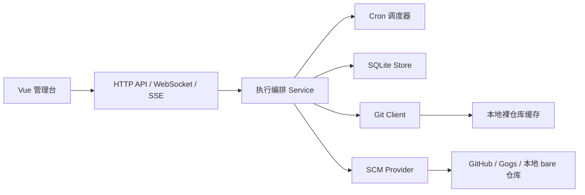

# RepoSync 系统架构

## 1. 目标

RepoSync 首版是一个单机部署的 Git 镜像同步管理台，面向单管理员使用。系统负责把一个或多个源仓库镜像同步到目标平台，并在需要时自动创建目标仓库。系统支持递归处理子模块仓库、改写子模块 URL 与 gitlink、复用本地裸仓库缓存，并通过实时日志流把执行进度反馈到前端。

## 2. 总体架构

## 3. 模块划分

### 后端

- `internal/app`
  - HTTP API、Webhook 入口、执行流接口
- `internal/service`
  - 任务 CRUD
  - 凭证 CRUD
  - 手动执行、Webhook 执行、定时执行编排
- `internal/git`
  - 系统 `git` 命令封装
  - Mirror clone / fetch / push
  - 子模块解析
  - `.gitmodules` 与 gitlink 改写
  - Git HTTPS / SSH 凭证注入与日志脱敏
- `internal/scm`
  - GitHub / Gogs / 本地 bare 仓库自动建仓
- `internal/store`
  - SQLite 持久化、迁移、查询
- `internal/scheduler`
  - Cron 调度注册、移除、状态查询

### 前端

- `src/views/DashboardPage.vue`
  - 任务管理
  - 调度状态
  - 执行详情树
  - Webhook 历史
  - 缓存与凭证管理
- `src/api.ts`
  - REST API 与执行流 URL 封装

## 4. 执行流程

### 4.1 手动 / 定时 / Webhook 统一执行流程

1. 根据任务 ID 读取 `SyncTask`
2. 校验任务是否启用
3. 创建 `SyncExecution`
4. 加载主仓库与子模块的 Git / API 凭证
5. 校验目标仓库是否存在
6. 若不存在则调用 GitHub / Gogs API 或初始化本地 bare 仓库
7. 定位任务级缓存根目录
8. 以 mirror 语义刷新裸仓库缓存
9. 若启用递归子模块，则解析 `.gitmodules` 与 gitlink
10. 深度优先同步所有子模块
11. 子模块全部成功后，先执行完整 mirror push
12. 对分支 refs 进行 `.gitmodules` 和 gitlink 改写后覆盖推送
13. 汇总状态、生成执行树、写回执行结果

### 4.2 Mirror 语义

- 缓存初始化使用 `git clone --mirror`
- 缓存更新使用 `git fetch --prune origin +refs/*:refs/*`
- 目标推送使用 `git push --mirror`
- 默认镜像所有分支、标签和其他 refs
- 首版不提供分支裁剪模式

### 4.3 子模块递归策略

- 通过 `.gitmodules` 解析子模块路径和源仓库 URL
- 通过 `git ls-tree` 获取子模块引用 commit
- 使用深度优先遍历构造执行树
- 使用 `visited` 集合检测循环依赖
- 任一子模块失败，主任务整体失败
- 子模块目标仓库保留目标仓库所在命名空间，并按 `.gitmodules` 中原始子模块 URL 的仓库名派生
- 递归完成后改写主仓库中的 `.gitmodules`
- 若子模块自身也发生递归改写，则父仓库 gitlink 一并改写到“同步后的子模块提交”

## 5. 凭证与认证

### 5.1 凭证分层

- 主仓库源 Git 凭证
- 子模块源 Git 凭证
- 主仓库目标 Git 凭证
- 子模块目标 Git 凭证
- 主仓库目标平台 API 凭证
- 子模块目标平台 API 凭证

所有子模块凭证字段都支持留空回退到主仓库对应字段。

### 5.2 Git 认证注入

- `https_token` / `api_token`
  - 对 HTTPS Git URL 注入 basic auth 用户名和 token
  - 对平台 API 请求注入 `Authorization` 头
- `ssh_key`
  - 执行时临时落盘为私钥文件
  - 通过 `GIT_SSH_COMMAND` 指定 `ssh -i <key>`
- 日志会统一脱敏，避免输出 token 或完整凭证信息

## 6. 目标仓库语义

- 非递归任务下，目标分支与源分支保持普通 mirror 关系
- 递归子模块任务下，目标分支会变成“可直接使用的派生提交”
- 在这种模式下，目标分支 HEAD 可能不同于源分支 HEAD
- 标签和其他非分支 refs 仍保持原始 mirror 语义
- 这样目标端用户可以直接执行 `git clone --recurse-submodules`

## 7. 前端静态资源提供

- 后端优先从 `REPOSYNC_FRONTEND_DIST` 指定的外部目录加载前端静态资源
- 如果外部目录不存在或缺少 `index.html`，则自动回退到二进制内嵌的前端构建产物
- 发布脚本会在构建后端二进制前，把最新前端 `dist/` 临时注入到 embed 目录

## 8. 实时日志与可观测性

- 执行阶段日志会持续写入 `summaryLog`
- 底层 Git 命令的 `stdout` / `stderr` 会逐行落库
- 前端优先通过 WebSocket 订阅 `/api/executions/:id/ws`
- 当 WebSocket 建立失败时，前端回退到 `/api/executions/:id/stream` SSE
- 执行详情页展示执行树、缓存命中、自动建仓、耗时、错误和日志

## 9. 缓存策略

- 主仓库和子模块分别命中各自缓存
- 缓存长期保留，默认不自动删除
- 支持按任务指定缓存保存根路径
- 任务可查看缓存健康状态、最近 fetch 时间、命中次数并手动清理

## 10. 安全原则

- 凭证不明文返回给前端
- 数据库存储使用对称加密保存敏感信息
- Git 与 API 日志统一脱敏
- Webhook 需要签名校验
- 同一任务同一时刻仅允许一个执行实例

## 11. SVN 到 Git 同步规划

系统后续会在现有 `git mirror` 任务之外新增 `SVN -> Git` 持续同步能力。
- 任务类型单独定义为 `svn_import`
- 执行实现基于系统 `git svn` 命令，不与现有 `git mirror` 流程混用
- `svn_import` 任务会把 SVN 历史持续拉取到本地，再推送到目标 Git 仓库
- 首版只支持标准 `trunk / branches / tags` 布局
- 首版只支持 `HTTP / HTTPS` 方式访问 SVN
- 目标 Git 仓库定位为只读镜像，不支持人工改写后继续增量同步

`svn_import` 执行链路规划如下：
1. 检查目标 Git 仓库是否存在，必要时复用现有自动建仓能力创建目标仓库
2. 初始化或复用本地 `git svn` 工作目录
3. 执行 `git svn fetch` 获取最新 SVN 修订
4. 把 `trunk`、`branches/*`、`tags/*` 映射为 Git branches / tags
5. 执行目标 Git 推送
6. 更新任务最近执行状态
7. 记录完整执行日志与错误信息
